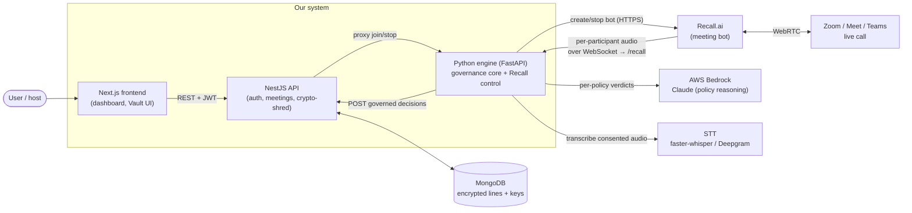
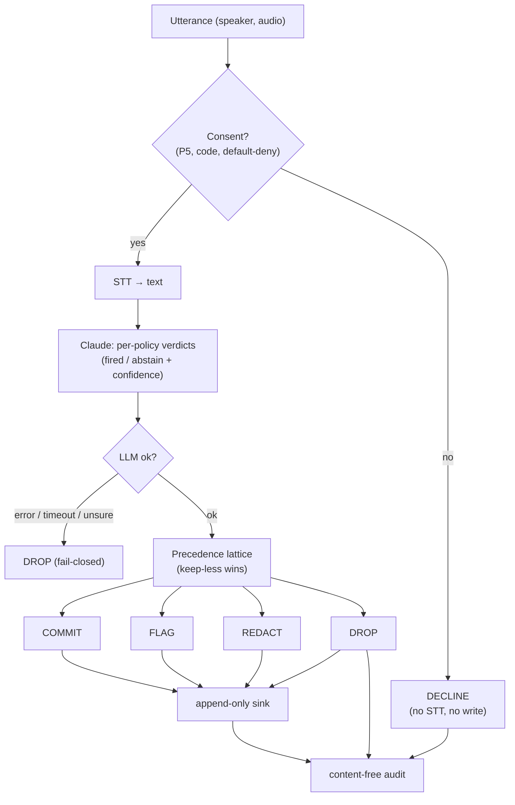
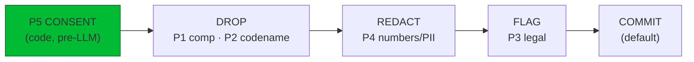
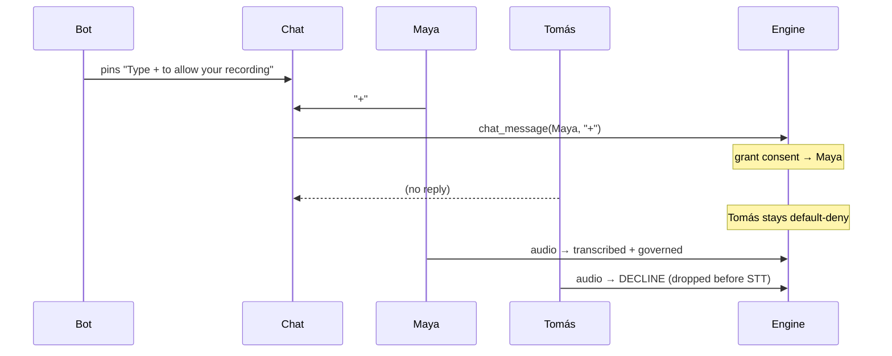
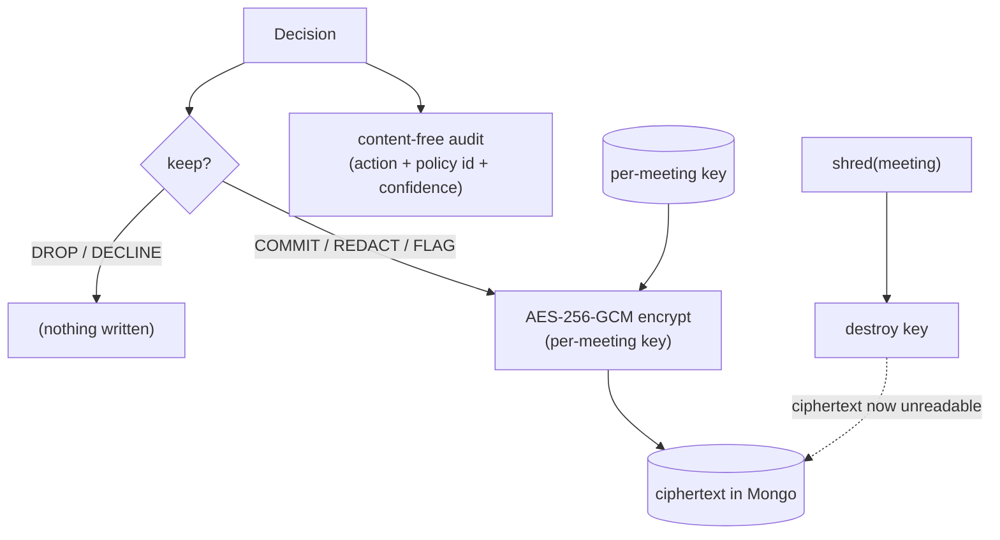
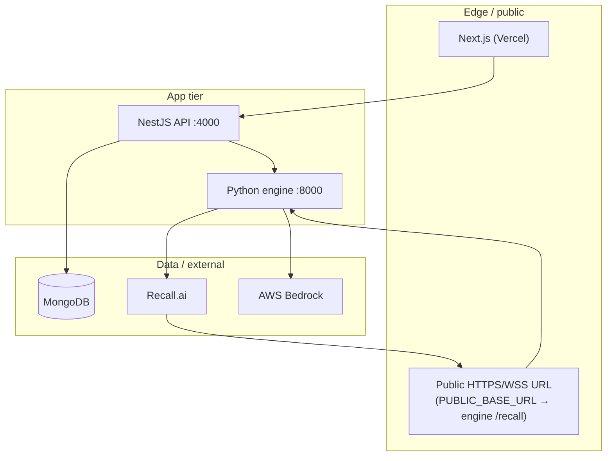
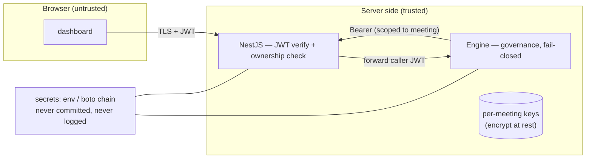

# Architecture — Meeting Governance

A **consent-first, real-time meeting governance** system. A bot joins a real Zoom / Google
Meet / Teams call, captures **per-participant** audio with identity, and governs every
utterance live: only speakers who consent are transcribed, sensitive content is redacted or
dropped *before* it is stored, nothing is written unless allowed, and any meeting can be
**crypto-shredded**. The one-liner: *decide what gets recorded before it's written down.*

> All diagrams below are Mermaid — they render on GitHub. The numbered prose explains each.

---

## 1. System context — services and externals

Three deployable services; everything sensitive (capture, reasoning, storage) is an external
the engine talks to over the network.



Key point: **we never implement WebRTC.** Recall's bot is the WebRTC participant inside the
call; it hands us *separated per-participant audio* over a plain WebSocket — which is exactly
the input the governance engine needs (see ADR in `INTERVIEW.md`).

---

## 2. Live multi-party governance — end-to-end flow

What happens from "someone speaks" to "it shows on the dashboard."

```mermaid
sequenceDiagram
  participant P as Participant (in call)
  participant R as Recall bot
  participant E as Engine /recall
  participant L as Bedrock (Claude)
  participant N as NestJS + Mongo
  participant D as Dashboard

  P->>R: speaks (+ chat "+" to consent)
  R->>E: per-participant audio frame (PCM16) + chat events (WebSocket)
  Note over E: buffer per speaker;<br/>chat "+" → grant consent (default-deny)
  E->>E: CONSENT GATE (before STT)
  alt speaker consented
    E->>E: STT → utterance text
    E->>L: per-policy verdicts (fired? confidence?)
    L-->>E: verdicts
    E->>E: precedence lattice → ONE action
    E->>N: POST decision (kept text encrypted; DROP/DECLINE send no text)
    N-->>D: poll → live decision + per-speaker consent
  else not consented
    Note over E: DECLINE — never transcribed, nothing stored
  end
```

---

## 3. The governance decision loop — `window → infer → act`

Per utterance, online, no look-ahead. The rule that makes it trustworthy: **the model judges,
the code acts.** Claude returns *advice* (per-policy verdicts); deterministic code makes the
*decision*.



---

## 4. Precedence lattice — "keep less always wins"

When multiple policies fire on one utterance, code resolves the conflict deterministically by
choosing the **most restrictive** action. Consent is checked first, in code, before the LLM
ever sees the audio.



| Action | Meaning | Writes to store? |
|--------|---------|------------------|
| DECLINE | speaker hasn't consented | no |
| DROP | sensitive (comp, codename) or LLM failed | no |
| REDACT | mask the spans (numbers/PII), keep the rest | yes (masked) |
| FLAG | legal/sensitive — keep but mark for review | yes (+ flag) |
| COMMIT | nothing fired | yes |

`fail-closed`: uncertainty (LLM error/timeout/low confidence) collapses to **DROP**, never to
COMMIT. The bias is always toward keeping *less*.

---

## 5. Consent — default-deny, per speaker, in-meeting

Nobody is recorded until they opt in *for themselves*. The gate runs **before STT**, so a
non-consenting participant's audio is never even transcribed.



---

## 6. Ephemerality and crypto-shredding

Two independent guarantees. **Decide-before-write**: there is a single append-only sink, and
DROP/DECLINE never call it — you cannot leak what was never written. **Crypto-shred**: kept
text is encrypted with a *per-meeting* key; destroying the key makes every stored byte
permanently unreadable — instant and verifiable, even across backups and replicas.



---

## 7. Deployment topology



`PUBLIC_BASE_URL` is the engine's own public URL (Recall connects *to it* at `/recall`); in
dev it's a cloudflared tunnel, in prod the deployed engine host. NestJS reaches the engine
server-to-server via `PYTHON_ENGINE_URL`.

---

## 8. Trust and security boundaries



- **In transit:** TLS everywhere; WebSocket to `/recall` is `wss`.
- **At rest:** kept text is AES-256-GCM encrypted per meeting; the audit log is content-free.
- **AuthZ:** every meeting route verifies JWT *and* that the meeting belongs to the caller.
- **Secrets:** AWS via the boto credential chain or `.env` (gitignored); `RECALL_API_KEY`,
  `DEEPGRAM_API_KEY`, `JWT_SECRET` from env; nothing secret is printed or committed.
- **Fail-closed:** any uncertainty in the governance path biases to *not* recording.

---

### Repos
- Engine (this repo): the governance core, Recall control, `/ws` + `/recall`.
- `meeting-governance-nest-api`: product API, auth, Mongo, crypto-shred.
- `meeting-governance-nextjs`: the dashboard.

See `INTERVIEW.md` for the design-decision rationale ("why not X?"), risk/security/compliance,
competitive positioning, and the roadmap.
